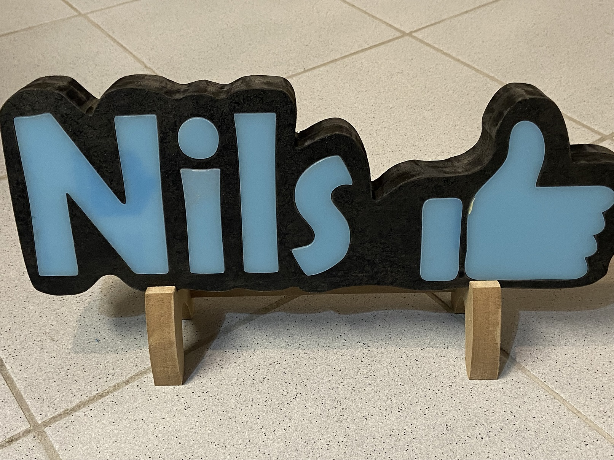

# NeonPixelLetter
Simple name or letters, illuminated from the back via WS2812B LED Strip.

Front cover is made out of acy´ryl with 45% transparency.
Wooden frame (MDF 20mm x2) has been created on the CNC Milling machine, acryl cut by laser.
For user input a TTP223 has been used.
